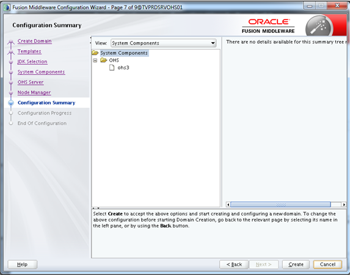

Creación de un componente OHS
========

- Requisitos:
1. Tener instalado los binarios de infraestructure y OHS.
2. Verificar que el entorno de las ventanas X esté operativo.

- Primero ejecutamos el script config.sh para proceder a crear un nuevo dominio:

- Seleccionamos crear nuevo dominio y asignamos la ruta de instalación:

- Seleccionamos el template de “Oracle HTTP Server (Standalone)”:

- Seleccionamos el JDK que utilizaremos para que corra el dominio:

- Asignamos el nombre del componente a crear:

- Indicamos los parámetros que tendrá el ohs server:

.. image:: ../imagenes/componente/Captura6.PNG

- Creamos el node manager del dominio y sus respectivas credenciales. Cabe destacar que si nos vamos a conectar a otro node manager, debemos utilizar estas mismas credenciales:

- Nos muestra el resumen de la configuración:

- Nos cargará el progreso de la instalación:

Nos indicará que la configuración se realizó satisfactoriamente:

- Iniciamos el componente creado con el binario startComponent.sh ubicado en la ruta $DOMAIN_HOME/bin. Mientras se ejecuta debemos ingresar el password que indicamos en las credenciales del node manager:

.. image:: ../imagenes/componente/Captura11.PNG

- Luego de iniciado el componente, verificamos que el puerto que le asociamos esté en escucha, así como el id del proceso:

- Sí cuando iniciemos el componente queremos que no nos pida la contraseña del node manager, debemos ejecutar el comando “./startComponent.sh ohs3 storeUserConfig” e ingresamos la clave. Esta acción nos creará un archivo de seguridad encriptado al cual hará referencia cada vez que se vaya a conectar al node manager:

